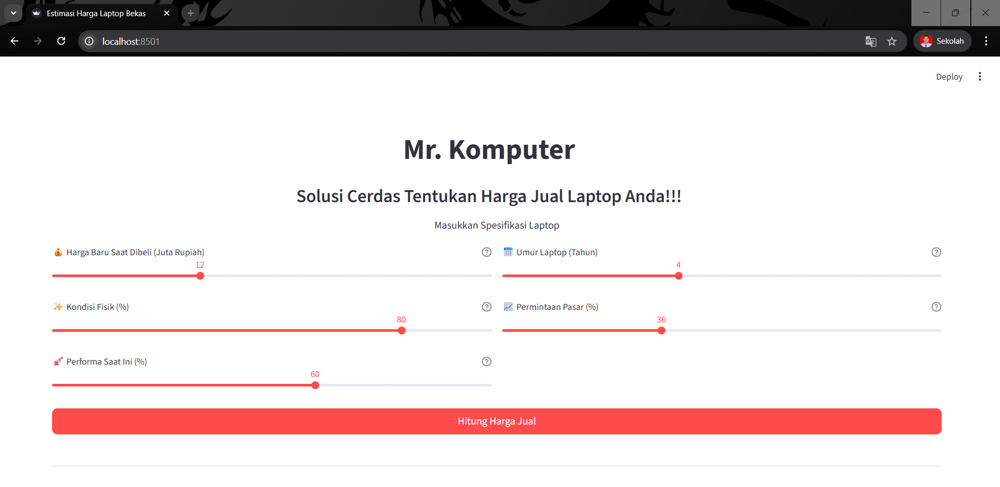
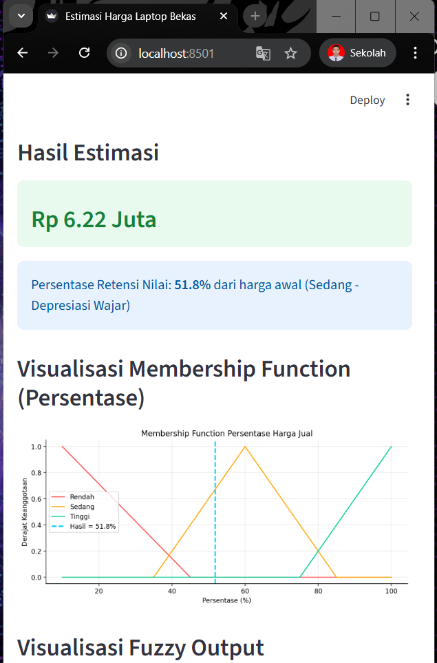

# Responsi 1 Praktikum Kecerdasan Buatan - Logika Fuzzy

- Nama: Faqih Ardiansyah
- NIM: H1D024047
- Shift Lama: A
- Shift Baru: B

## Deskripsi Project
Dr. Komputer adalah sebuah Logika Fuzzy yang dibangun menggunakan Python dan Streamlit. Sistem ini dirancang untuk menentukan harga jual laptop second berdasarkan harga beli dulu, performa, umur, permintaan pasar dan kondisi.

## Screenshot



## Cara Menjalankan Project (Lokal)

1. Clone repositori ini:
   ```bash
   git clone https://github.com/faqihardi/H1D024047-PraktikumKB-Responsi1-Fuzzy.git mr_komputer
   ```
2. Masuk ke direktori project:
   ```bash
   cd mr_komputer
   ```
3. Install semua dependencies yang dibutuhkan:
   ```bash
   pip install -r requirements.txt
   ```
4. Jalankan aplikasi menggunakan Streamlit:
   ```bash
   streamlit run app.py
   ```

## Akses Aplikasi
Aplikasi ini juga telah di-deploy dan dapat diakses secara langsung melalui link berikut:
[https://h1d024047-mrkomputer.streamlit.app/]
